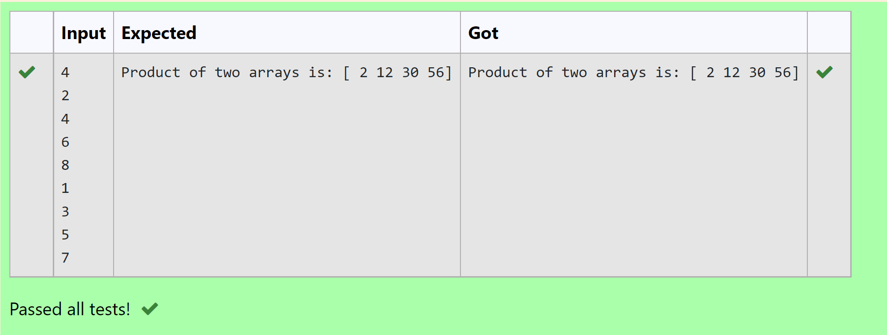

# Multiplying-two-matrix

## AIM:
To write a python program for multiplying two matrix.

## ALGORITHM:

### Step 1:
Import Numpy as np.
### Step 2:
Get input from the user.
### Step 3:
Create empty lists l1 and l2.
### Step 4:
Use for loop to append the values into the list created.
### Step 5:
Print the product of two arrays.

## PROGRAM:
```
To write a python program for multiplying two matrix.
Developed by: Anitha P
Register no: 21500186

import numpy as np
n=int(input())
l1,l2=[],[]
for i in range(n):
    l1.append(int(input()))
for i in range(n):
    l2.append(int(input()))
A=np.array(l1)
B=np.array(l2)
print("Product of two arrays is:",A*B)

```

## OUTPUT:


## RESULT:

